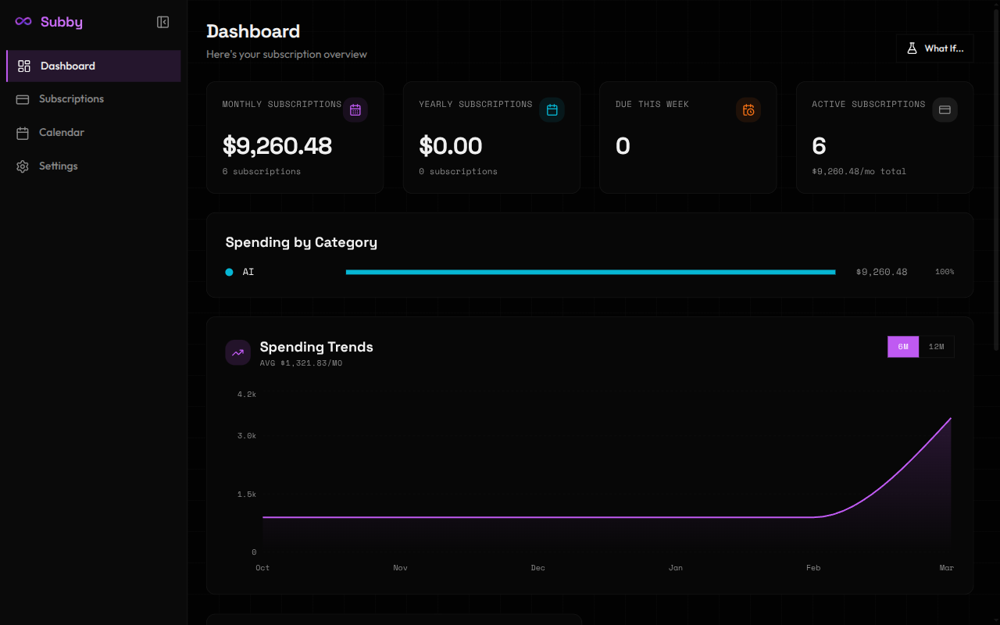
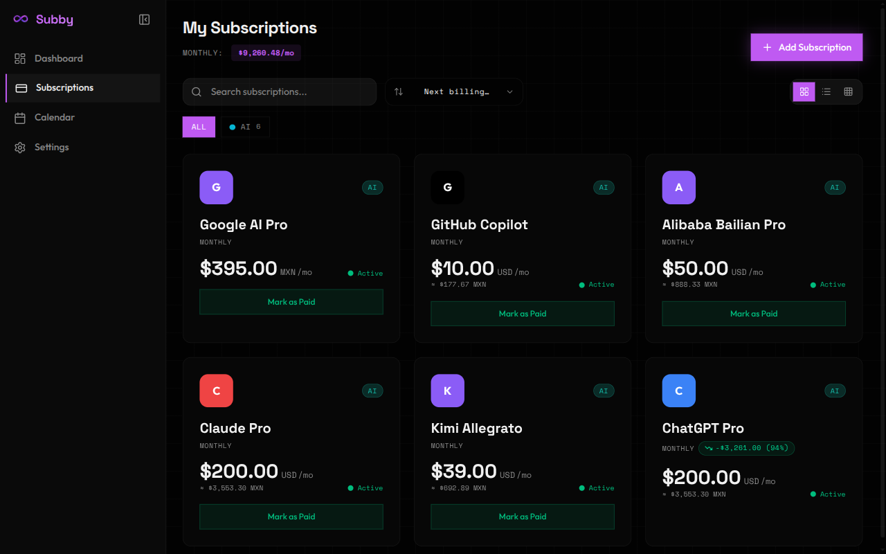
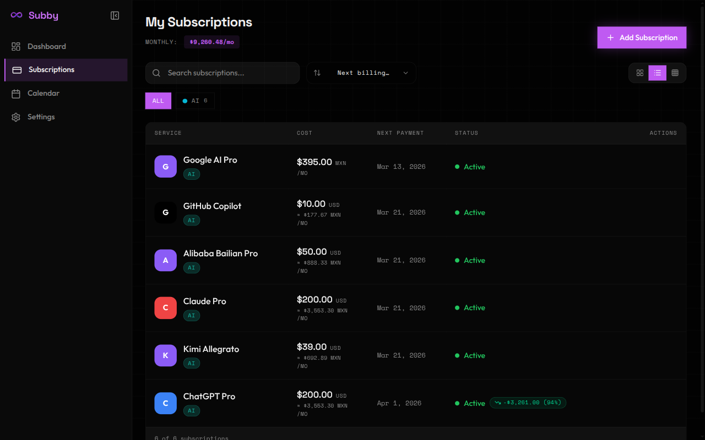
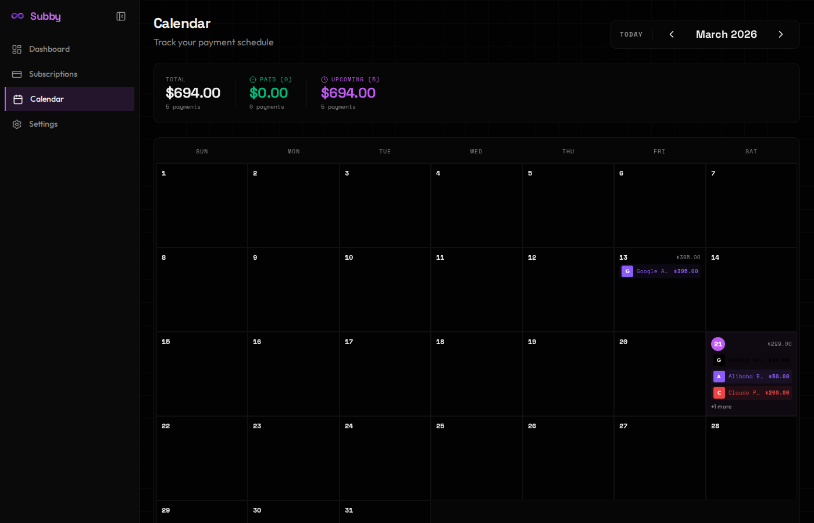
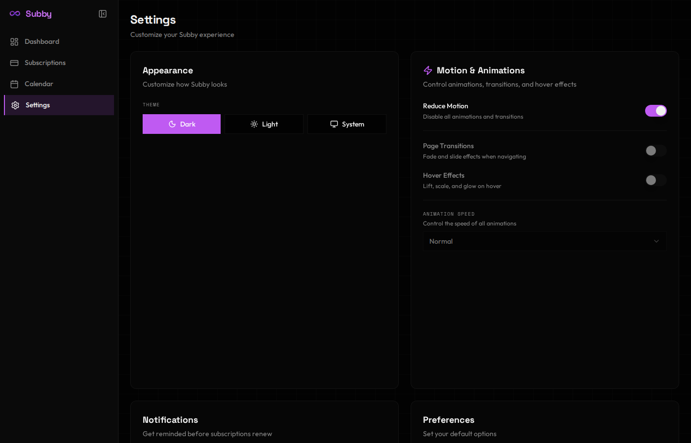
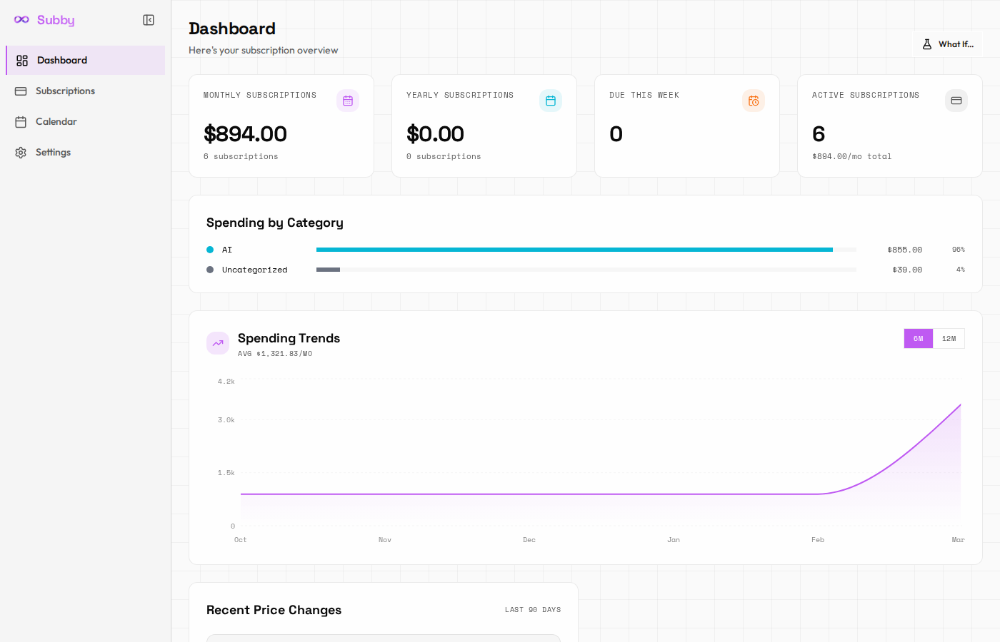
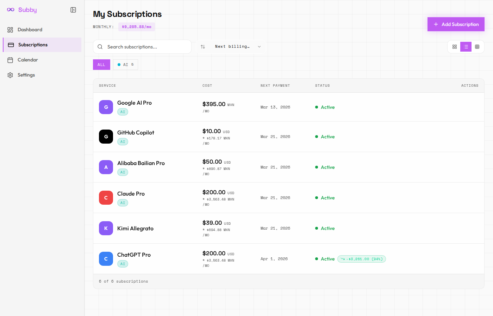

<p align="center">
  
</p>

<h1 align="center">Subby</h1>

<p align="center">
  <strong>Know where your money flows.</strong>
</p>

<p align="center">
  A beautiful, local-first subscription tracker built with Tauri, React, and SQLite.
  <br />
  No cloud. No accounts. No tracking. Just you and your data.
</p>

<p align="center">
  <a href="https://opensource.org/licenses/MIT">
    
  </a>
  <a href="https://github.com/AI-Strategic-Forum/Subby/releases">
    
  </a>
  <a href="https://github.com/AI-Strategic-Forum/Subby/actions">
    
  </a>
  
  
  <a href="https://github.com/AI-Strategic-Forum/Subby">
    
  </a>
</p>

<br />

<p align="center">
  
</p>

<p align="center">
  <a href="#features">Features</a> &bull;
  <a href="#screenshots">Screenshots</a> &bull;
  <a href="#installation">Install</a> &bull;
  <a href="#web-mode">Web Mode</a> &bull;
  <a href="#cli--mcp">CLI & MCP</a> &bull;
  <a href="#development">Development</a>
</p>

---

## Why Subby?

Most subscription trackers are cloud-based, require accounts, and monetize your financial data. Subby takes a different approach:

|                           |         Subby         | Cloud Trackers |
| ------------------------- | :-------------------: | :------------: |
| **Works offline**         |           Yes          |       No       |
| **No account needed**     |           Yes          |       No       |
| **Open source**           |           Yes          |     Rarely     |
| **Your data stays local** |           Yes          |       No       |
| **Free forever**          |           Yes          |    Freemium    |
| **Cross-platform**        | Linux, macOS, Windows  |    Web only    |
| **CLI + AI integration**  |           Yes          |       No       |

---

## Features

### Core
- **Dashboard** -- Monthly/yearly stats, category breakdown, spending trends chart, budget tracking, and daily cost insights
- **Subscription Management** -- Grid, list, and bento views with search, sort, and category filtering. 100+ service templates with bundled logos
- **Payment Calendar** -- Visual monthly calendar showing payment due dates. Mark as paid, skip, or view details
- **Spending Analytics** -- Dedicated analytics page with monthly spending charts, year summaries, spending velocity, and category breakdowns

### Organization
- **Categories** -- 9 built-in categories + unlimited custom ones with colors and icons
- **Tags** -- Flexible tagging system alongside categories. Create, assign, and filter by tags
- **Pin/Favorite** -- Pin important subscriptions to the top of any view
- **Global Search** -- `Cmd+K` command palette to search subscriptions, navigate pages, and trigger actions from anywhere

### Financial
- **Multi-Currency** -- 10 currencies (USD, EUR, GBP, JPY, CAD, AUD, MXN, CNY, INR, BRL) with live conversion
- **Cost Normalization** -- Toggle to view all costs as daily, weekly, monthly, or yearly regardless of billing cycle
- **Monthly Budget** -- Set spending limits with progress bar and over-budget alerts
- **Price History** -- Automatic detection of price changes with timeline and percentage tracking
- **Shared Subscriptions** -- Split costs with family or friends

### Lifecycle
- **Trial Tracking** -- Track free trials with countdown timers and expiry alerts
- **Cancellation Tracking** -- Record cancellation reasons, view subscription graveyard
- **Review Nudges** -- Monthly prompts for subscriptions you haven't reviewed in 30+ days
- **Smart Reminders** -- Configurable notifications 1, 3, 7, 14, or 30 days before renewal

### Platform
- **System Tray** -- Badge showing upcoming payment count, close-to-tray behavior
- **Desktop Auto-Updates** -- Check GitHub Releases and install signed updates in-app
- **Keyboard Shortcuts** -- `N` new, `/` search, `?` help, `1-5` navigate, `Cmd+K` search
- **Data Portability** -- Export/import JSON backups. Import from CSV, Wallos, or Bobby
- **Web Mode** -- Run as a web server for browser access on any device
- **CLI + MCP** -- Terminal management and AI assistant integration
- **Discord Bot** -- Daily payment reminders and spending summaries
- **Dark/Light Themes** -- Glassmorphic design with motion controls

---

## Screenshots

<p align="center">
  
</p>

<p align="center">
  <em>Dashboard -- Spending stats, category breakdown, trend charts, price change tracking, and insights</em>
</p>

<br />

<p align="center">
  
  
</p>

<p align="center">
  <em>Subscriptions -- Grid and list views with category badges, multi-currency conversion, and price change indicators</em>
</p>

<br />

<p align="center">
  
  
</p>

<p align="center">
  <em>Calendar and Settings -- Payment schedule and full customization</em>
</p>

<details>
<summary><strong>Light Mode</strong></summary>
<p align="center">
  
  
</p>
</details>

---

## Installation

### Download

Grab the latest release from [GitHub Releases](https://github.com/AI-Strategic-Forum/Subby/releases):

| Platform            | File                          | Install                                |
| ------------------- | ----------------------------- | -------------------------------------- |
| **Ubuntu/Debian**   | `subby_x.x.x_amd64.deb`      | `sudo dpkg -i subby_*.deb`            |
| **Fedora/RHEL**     | `subby_x.x.x_amd64.rpm`      | `sudo rpm -i subby_*.rpm`             |
| **Any Linux**       | `subby_x.x.x_amd64.AppImage` | `chmod +x *.AppImage && ./*.AppImage`  |
| **macOS (Silicon)** | `Subby_x.x.x_aarch64.dmg`    | Drag to Applications                   |
| **macOS (Intel)**   | `Subby_x.x.x_x64.dmg`        | Drag to Applications                   |
| **Windows**         | `Subby_x.x.x_x64-setup.exe`  | Run installer                          |

### Build from Source

```bash
git clone https://github.com/AI-Strategic-Forum/Subby.git
cd Subby
pnpm install
pnpm tauri build
```

<details>
<summary><strong>One-line installer (Linux)</strong></summary>

```bash
./install.sh
```

Options: `--app` (desktop only), `--bot` (Discord bot only), `--all` (both), `--dry-run` (preview).

</details>

---

## Web Mode

Run Subby as a web server accessible from any browser:

```bash
cargo run -p subby-web -- --port 3000
```

Open `http://localhost:3000`. Uses the same SQLite database as the desktop app.

---

## CLI & MCP

### CLI

```bash
cargo build --release -p subby-mcp

subby-mcp list                           # List all subscriptions
subby-mcp add "Netflix" 15.99 monthly 2026-04-01
subby-mcp stats                          # Dashboard statistics
subby-mcp upcoming --days 14             # Upcoming payments
subby-mcp export --output backup.json    # Export data
```

### MCP (AI Integration)

Subby includes an [MCP](https://modelcontextprotocol.io/) server for AI assistants like Claude.

```json
{
  "mcpServers": {
    "subby": {
      "command": "/path/to/subby-mcp",
      "args": []
    }
  }
}
```

10 tools (`add_subscription`, `update_subscription`, `remove_subscription`, etc.) and 5 resources (`subby://subscriptions`, `subby://stats/dashboard`, etc.).

See the [MCP Setup Guide](docs/guides/mcp-setup.md) for details.

---

## Tech Stack

| Layer        | Technology                                         |
| ------------ | -------------------------------------------------- |
| **Runtime**  | Tauri 2 (Rust backend)                             |
| **Frontend** | React 19 + TypeScript + Vite 7                     |
| **Styling**  | Tailwind CSS 4 + shadcn/ui                         |
| **State**    | Zustand                                            |
| **Database** | SQLite via rusqlite                                |
| **Charts**   | Recharts                                           |
| **Forms**    | React Hook Form + Zod                              |
| **Testing**  | Vitest + Testing Library + Playwright              |

---

## Development

### Prerequisites

- Node.js 18+ and pnpm 9+
- Rust (via [rustup](https://rustup.rs/))
- Platform deps: `libwebkit2gtk-4.1-dev` (Linux), Xcode CLI (macOS), WebView2 (Windows)

### Commands

```bash
pnpm tauri dev           # Start dev app
pnpm test:run            # Run 517 tests
pnpm check               # Lint + typecheck + format
cargo test --workspace   # Run 22 Rust tests
pnpm test:e2e            # Playwright E2E tests
```

### Project Structure

```
Subby/
├── src/                    # React frontend
│   ├── components/         # UI components
│   ├── pages/              # Dashboard, Subscriptions, Calendar, Analytics, Settings
│   ├── stores/             # Zustand state (subscriptions, tags, settings, etc.)
│   ├── hooks/              # Custom hooks (analytics, search, notifications)
│   ├── types/              # Zod schemas + TypeScript types
│   └── lib/                # Utilities (currency, dates, CSV import)
├── src-tauri/              # Rust backend + Tauri commands
├── crates/
│   ├── subby-core/         # Shared Rust logic + SQLite + migrations
│   └── subby-mcp/          # MCP server + CLI
├── packages/
│   └── discord-bot/        # Discord reminder bot
└── e2e/                    # Playwright E2E tests
```

---

## Data & Privacy

All data stays on your device. No cloud, no telemetry, no analytics.

| Platform | Database Location                      |
| -------- | -------------------------------------- |
| Linux    | `~/.local/share/com.asf.subby/`        |
| macOS    | `~/Library/Application Support/com.asf.subby/` |
| Windows  | `%APPDATA%/com.asf.subby/`             |

Plain SQLite -- inspect, backup, or migrate with any SQLite tool.

---

## Contributing

1. Fork the repo
2. Create a branch (`git checkout -b feature/amazing`)
3. Run checks: `pnpm check && pnpm test:run && cargo test --workspace`
4. Open a PR

See [CONTRIBUTING.md](CONTRIBUTING.md) for guidelines.

---

## License

[MIT](./LICENSE)

<p align="center">
  <br />
  Built by <a href="https://github.com/AI-Strategic-Forum">AI Strategic Forum</a>
  <br /><br />
  <a href="https://github.com/AI-Strategic-Forum/Subby">GitHub</a> &bull;
  <a href="https://github.com/AI-Strategic-Forum/Subby/releases">Releases</a> &bull;
  <a href="https://github.com/AI-Strategic-Forum/Subby/issues">Issues</a>
</p>
